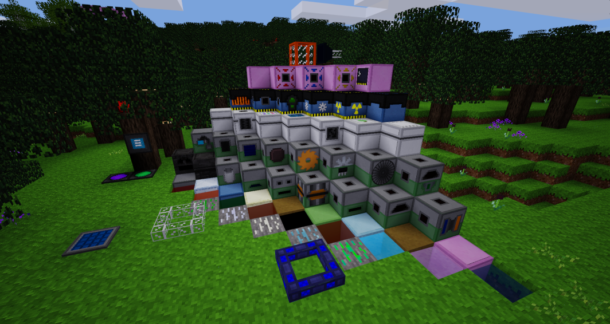

# Elepower

A new *powerful* modpack for [Minetest](http://minetest.net) 5.0.0+!

**I do not recommend using this modpack with technic, as this modpack aims to become an all new technology mod. However, compatibility might be added at a later date.**

**Depends on [fluid_lib](https://gitlab.icynet.eu/evert/fluid_lib)!**

## Features

### Universal Electric Power API
How is this any different from technic I hear you asking? Well, first of all, I have eliminated the concept of "tiers" in the **technic** sense, as all types of machines will now be accepting any conduit. Machines can be upgraded for speed and efficiency.

### Universal Fluid Transfer API
Exactly what it sounds like. Pipeworks failed to do this. Works with [melterns](https://gitlab.icynet.eu/evert/melterns)!

### Machinery
Machines for doubling your ore output and helping you create more powerful materials.

### Tools
Powered tools that you can simply recharge instead of crafting them again.

### Farming
Farming automation machines: automatic planting and harvesting of crops.

### Nuclear
Nuclear power. Both fission and fusion will (soon) be presented!
