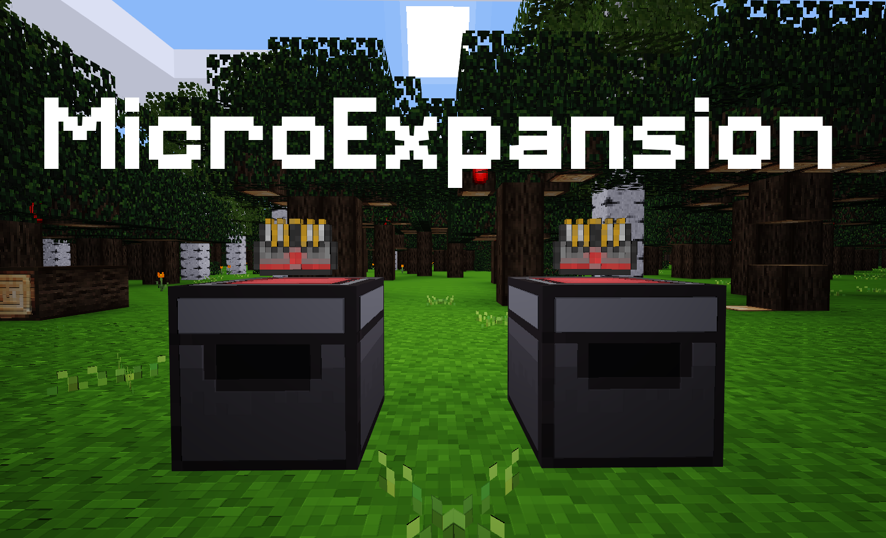

MicroExpansion - ME [microexpansion]
======================================

* **Version:** 0.2, unstable
* **Licence:** Code: MIT (see LICENSE), Media: CC-BY-SA 3.0
* [Github Repository](https://github.com/octacian/microexpansion)
* **Downloads:**
  * [Master (Unstable)](https://github.com/octacian/microexpansion/archive/master.zip)
  * ...or browse the code on [GitHub](https://github.com/octacian/microexpansion)

**Note**: MicroExpansion requires that you have `minetest-dev` with [this commit](https://github.com/minetest/minetest/commit/f2f9a923515386d787a245fac52f78e815b3a839) or later.

When you really get into a survival world, you typically end up with a lot of items, like a ton of items. Sometimes literally. But with that huge amount of resources, comes something annoying and typically unwanted: chests. Well, of course. You have to have chests to store items, but no biggie, it's just chests. Then your storage room starts to grow, soon you have 25 chests, then 50, then 100. Management gets kinda hard. MicroExpansion, is the solution.

Originally inspired by Applied Energistics 2 for Minecraft, MicroExpansion introduces many new nodes and items giving the player simpler and more compact ways to store thousands of items inside of a single ME drive.

**Note:** not all the features mentioned above are complete, so see the list directly below for planned and complete features.

### To Do List
- [x] ME Chests
- [ ] ME Networks
- [ ] Remote Access to ME Networks
- [ ] Spatial Storage Drives
- [ ] ...and more.

### Discussion / Issues
Discussion should take place here, on the forum post, or on enDEV IRC (irc.endev.xyz, port 6697, SSL, accept invalid certs), channel `#minetest`. Features requests should be made on the forum or through a GitHub issue. Bugs can best be reported by creating an issue on GitHub.
